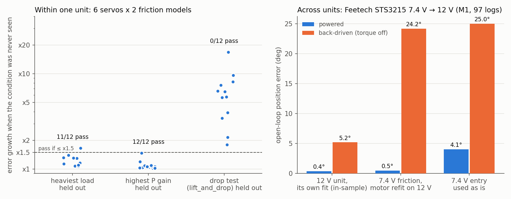

# PartGap

**Servo settings for your simulator, plus how much error to expect and where the numbers stop holding.**

PartGap is a small library of identified actuator models for common hobby and research servos.
You give it a part and your firmware gain. It returns MuJoCo settings, the position error you should expect,
and warnings when you leave the conditions the part was measured under.

v0.1 covers 6 servos, built from 946 public test-bench logs:
Dynamixel MX-64, MX-106 and XL330, Feetech STS3215 (7.4 V and 12 V), and Waveshare ST3025.
The friction models and the simulator come from [BAM](https://github.com/Rhoban/bam)
(Duclusaud et al., ICRA 2025). PartGap adds three things: a test of how far each entry transfers,
a MuJoCo export that has been checked against BAM, and the warnings that follow from both.



## What carries over, and what doesn't

The thresholds and splits were fixed before the results were seen ([`PLAN.md`](PLAN.md)). Details are in
[`findings/phase3-first-findings.md`](findings/phase3-first-findings.md) (Korean).

- **Loads and gains carry over within a unit.** Holding out the heaviest load and refitting kept the error
  within 1.5x in 11 of 12 cases. Holding out the highest P gain kept it within 1.5x in 12 of 12.
- **Back-driven motion does not carry over.** Back-driven means the torque is off and the load drives the gearbox.
  A fit that never saw a drop test was off by 1.8x to 16.8x on drop tests, for every servo.
  Almost all of the extra error came from the torque-off phases. Powered-phase error rose only slightly
  (largest: 0.29° to 0.43°). This breakdown is an exploratory analysis.
- **The pre-registered cross-unit test failed.** The two units are an STS3215 7.4 V and a 12 V version from another lab,
  with the same 345:1 gearbox. Moving the 7.4 V entry to the 12 V unit left 2.5x (friction only, motor constants
  refit) to 5x (as is) the error of the 12 V unit's own fit. A post-hoc split by phase shows where it fails.
  With the 7.4 V friction and refit motor constants, powered error was 0.5° and back-driven error was 24°.
  The 12 V unit's own fit, measured in-sample, gave 0.4° and 5°. This is a single pair, and the two differ in motor winding as well as unit,
  so read it as a hint.
- **Two calibration logs were not enough to close that gap.** Starting from the 7.4 V entry and fitting on two
  12 V logs (one drop test, one other) left 1.7x (M6) to 2.2x (M1) the error of a full fit on that unit.

In short: an entry is reliable for **powered position tracking** across loads and gains.
If your robot falls, gets pushed, or runs with torque off, measure your own unit, including drop tests.

## Use

```bash
pip install -e .
partgap list
partgap feetech_sts3215_7v4 --kp 32 --vin 7.4 --inertia 0.05
```

```
MuJoCo:
<joint name="joint" type="hinge" damping="0.617901" frictionloss="0.0529217" armature="0.0260753"/>
<position name="joint_servo" joint="joint" kp="18.8465" forcerange="-3.40138 3.40138" forcelimited="true"/>
note: firmware limits the goal to 5.28 rad/s: rate-limit ctrl (partgap.export.CommandFilter)
note: ...

expected open-loop position error: 1.00 deg (open-loop pendulum logs at kp=32, all loads and trajectories)
WARNING: load inertia 0.05 kg m^2 is above the measured max 0.02439. Holding out the heaviest load grew the error x1.30
WARNING: back-driven motion (torque off, or the load driving the joint) is the weak spot: ...
```

```python
from partgap.query import lookup
from partgap.export import CommandFilter

r = lookup("dynamixel_mx64", kp=32)
p = r["mujoco"]                  # gain, forcerange, damping, frictionloss, armature, ...
filt = CommandFilter(p, dt=0.005)
data.ctrl[i] = filt(goal, data.qpos[j])   # applies firmware delay and goal rate limit
```

`--model m6` returns BAM's extended model parameters instead. To use them, pass them to BAM's MuJoCo controller.
Lookups only need the JSON entries in `db/parts/`. BAM is required only to rebuild the entries.

### How the MuJoCo export works

A voltage-controlled servo with a firmware P loop is exactly a MuJoCo position actuator:

| MuJoCo | from the entry |
|---|---|
| `kp` | error_gain x gain ratio x kp x Vin x kt / R |
| `forcerange` | ± max_pwm x Vin x kt / R |
| joint `damping` | viscous friction + kt²/R (back-EMF) |
| joint `frictionloss` | Coulomb friction |
| joint `armature` | rotor + gearbox inertia |

BAM's own `to_mujoco` puts `max_pwm` on the gain instead of the force limit. This form matches BAM's torque law
exactly (`tests/test_export.py`). Replaying all 946 logs in MuJoCo 3.14.0 gave 1.01x to 1.12x the error of BAM's
own simulator. Results at 5 ms and 1 ms timesteps differed by at most 0.02°.

## Entries

| Part | Logs | M1 error | M6 error | Measured kp | Source |
|---|---|---|---|---|---|
| Dynamixel MX-64 | 112 | 1.31° | 0.49° | 4–32 | Rhoban BAM |
| Dynamixel MX-106 | 144 | 1.11° | 0.70° | 4–32 | Rhoban BAM |
| Dynamixel XL330-M288-T | 358 | 1.90° | 1.29° | 50–300 | Rhoban BAM |
| Feetech STS3215 7.4 V | 100 | 1.39° | 0.88° | 4–32 | Rhoban BAM |
| Feetech STS3215 12 V | 97 | 0.94°* | 0.93° | 4–32 | T-K-233/bam |
| Waveshare ST3025 | 135 | 1.35° | 1.11° | 4–32 | i1Cps/duck_mini_pro_headless |

Errors are open-loop position MAE on held-out logs (random 80/20 split). M1 is Coulomb plus viscous friction,
which is native in MuJoCo and PyBullet. M6 is BAM's extended model. \*This value comes from an under-converged fit,
and the 19 held-out logs happened to be easy ones. For reference, the all-logs fit scores 1.19° in-sample.

Each entry ([schema](db/schema.json)) records where it was measured, the range of conditions it covers,
how much the error grew when each condition was held out, and the result of the cross-unit test where one exists.

## Reproduce

```bash
pip install -r requirements.txt
scripts/fetch.sh                          # BAM at e9a619d + raw logs (~45 MB) -> data/processed/
python experiments/run_fits.py            # v1 fits, ~2 h on 2 cores
python experiments/run_fits_v2.py         # fit protocol v2 (PLAN.md, revision 3)
python experiments/analyze.py             # P0, Q0-Q3 -> results/analysis.json
python experiments/q2_robustness.py
python experiments/q4_mujoco_export.py
python experiments/q5_calibration.py
python experiments/build_db.py            # -> db/parts/*.json
python experiments/figures.py
pytest
```

## Limits

- Every log comes from a single-pendulum bench. Coupled multi-joint loads are not tested.
- Each part was measured on one physical unit. The cross-unit test is a single pair, and it also crosses a voltage version.
- Four split fits remain under-converged after refitting. The findings spell out which way each one could push its
  conclusion. Where a verdict depends on one of them, the same verdict holds for every other fit in that test.
- The raw-log licenses are not stated by their sources. This repo publishes only fitted parameters and summaries,
  and `scripts/fetch.sh` downloads the logs from their original locations.

## Related

- [simdiff-check](https://github.com/bluvtx09/simdiff-check): a linter for MuJoCo and PyBullet settings that silently break results.
- [joint-gap-protocol](https://github.com/bluvtx09/joint-gap-protocol): splits the sim-to-real joint gap into components.
- [BAM](https://github.com/Rhoban/bam): the friction models and identification pipeline used here.

## License

MIT for this repository. BAM is Apache-2.0 and is fetched, not vendored.
