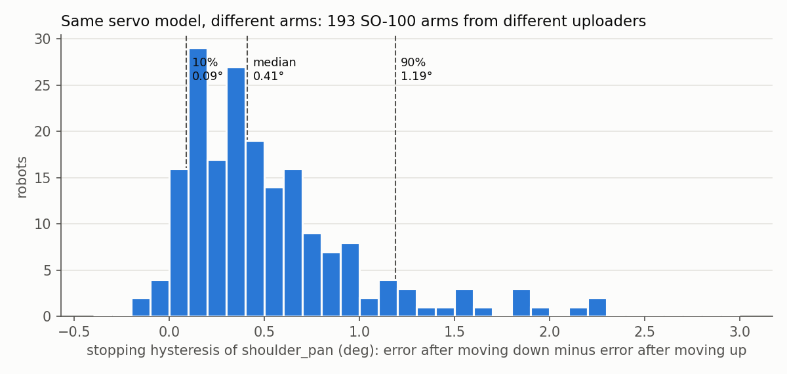

# 사업 가정 검증 결과

2026-10-01. 판정 기준은 `PLAN.md`에 결과 전에 고정했다. H1은 직접 분석했고(`h1/`), H2·H3은 공개 자료 조사다.

## 쉬운 말 요약

사업안은 "시뮬과 실물이 똑같이 움직이는 저마찰 관절을 판다"였다. 이게 되려면 세 가지가 맞아야 했다.

| 가정 | 판정 | 한 줄 |
|---|---|---|
| H1. 같은 서보도 팔마다 다르게 움직인다 (문제가 있다) | **통과** | SO-100 팔 193대를 비교하니 멈출 때 생기는 오차가 팔마다 3.8배(중간 50% 기준) 달랐다. 잡음이 아니라 팔마다 일정한 차이다. |
| H2. 저마찰 관절은 개체 차이가 작다 (내 해법이 통한다) | **미검증, 반대 증거 있음** | 저마찰 관절이 개체끼리 비슷하다는 측정이 없다. 오히려 기어 달린 Dynamixel 서보가 "개체끼리 거의 같았다"는 보고가 있다. |
| H3. 돈을 낼 사람이 있고 같은 제품이 없다 (팔 수 있다) | **기준상 통과, 약함** | 불만 사례 7~8건(반응은 적음). 100달러 미만에 "저마찰 + 시뮬 모델"을 파는 제품은 없음. 더 좋은 서보에 돈을 더 내는 사람은 있지만, "시뮬과 맞는다"에 돈을 낸 증거는 없음. |

**가장 큰 문제는 H2다.** 문제(개체 차이)는 실제로 있다. 그런데 "새로운 저마찰 구조"가 그 해법이라는 근거가 없다.
Dynamixel처럼 품질 관리가 좋은 기성 서보가 이미 개체 차이가 작다면, 해법은 새 구조가 아니라 **좋은 품질 관리나 개체별 보정**일 수 있다.
그 경우 고객은 우리 관절 대신 더 비싼 기성 서보를 사면 된다.

## H1. 같은 버전 서보의 개체 차이 — 통과

**방법.** Hugging Face에서 LeRobot SO-100 데이터셋 4,158개를 찾았다. 그중 각도를 도(degree)로 기록한 형식(`so100`, v2.x, 에피소드 10개 이상)을 골라 업로더당 하나씩 287개를 받았다.
업로더가 다르면 다른 팔이고, 다른 서보 개체다. 수직축으로 도는 `shoulder_pan` 관절에서 히스테리시스를 쟀다.
히스테리시스 = (위에서 내려와 멈췄을 때의 오차) − (아래에서 올라와 멈췄을 때의 오차). 이 관절은 중력을 받지 않고, 사용자마다 다른 보정 오프셋은 두 값을 빼면 지워진다.

**결과 (사전 등록 지표).**
- 조건(방향별 정지 구간 5개 이상, 에피소드 짝·홀 양쪽)을 채운 팔: 193대
- 히스테리시스: 하위 10% 0.09°, 중앙값 0.41°, 상위 10% 1.19°. P90/P10 = **13.2배** → 기준(2배 이상)으로 "크다"
- 신뢰도: 에피소드를 짝수·홀수로 나눠 잰 두 값의 팔 순위 상관 **0.86** (기준 0.5 이상). 팔 사이 차이는 실제이고 안정적이다.

**탐색 분석 (사전 등록 아님).**
- 하위 10% 값이 엔코더 한 칸(0.088°) 수준이라 P90/P10은 부풀 수 있다. 바닥에 덜 민감한 P75/P25는 **3.8배**로, 여전히 2배를 넘는다.
- 동작 속도와는 관련이 없었다(스피어만 0.07).
- 녹화 날짜와는 관련이 있었다(-0.32, 최근일수록 작음). 그래도 오래된 절반 안에서 11.6배, 최근 절반 안에서 13.0배로 차이가 남는다.
- 움직이는 동안의 추종 오차와는 약하게 관련된다(0.19).

**한계.** 이 값은 "현장에서 팔마다 얼마나 다르게 움직이는가"이지, 순수한 제조 편차가 아니다.
STS3215에는 펌웨어 데드존(기본 10 엔코더 칸 = 약 0.88°, Robonine 측정)이 있다. 사용자나 LeRobot 버전에 따라 이 설정, P게인, 7.4V/12V 버전이 다를 수 있다.
날짜와의 상관은 설정 변화의 흔적일 수 있다. 제조 편차인지 설정 차이인지는 같은 설정으로 서보 여러 개를 직접 재야 가려진다.

## H2. 저마찰 관절은 개체 차이가 작은가 — 미검증, 반대 증거 있음

| 기준 | 증거 | 판정 |
|---|---|---|
| (a) 정격 토크 대비 마찰이 기어드 서보의 1/3 이하 | 정지 마찰/최대 토크: Unitree A1 1.3%, Go1 0.6%, 10:1 사이클로이드 QDD 2.2~5.3%, 8:1 QDD 0.95~2.3%. 기어드 서보: Dynamixel XH540 1.0%, XM430 1.6%, XC330 4.7%, 2XL430 8.3%, STS3215 약 2.8% | **불충족.** 범위가 겹친다. 차이는 하중이 커질 때 늘어나는 마찰(기어 효율) 쪽에서만 분명하다 |
| (b) 같은 모델 여러 개체 편차 20% 이하, 또는 한 모델로 여러 개체 이전 성공 | QDD 다개체 마찰 측정은 찾지 못했다. 가장 가까운 자료(TYTAN 4다리, 관절별 맞춤): 마찰 최대/최소 약 1.4배, 감쇠는 약 4.9배. Berkeley Humanoid Lite(인쇄 사이클로이드 6개): 토크 오차 ±0.5 N·m, 백래시 표준편차 0.0042 rad | **미검증** |
| 반대 증거 | ToddlerBot: "Testing across instances shows Dynamixel motors of the same model have nearly identical dynamics parameters" (기어드 서보, 두 번째 로봇에 추가 보정 없이 정책 이전 성공) | 기어 유무보다 **제조 품질**이 개체 차이를 정할 가능성 |

자기 기어 액추에이터는 로봇 관절의 마찰 측정도, 상용 제품도 찾지 못했다.

## H3. 수요와 경쟁 — 기준상 통과, 약함

- (a) 저가 서보 사용자의 시뮬-실물·액추에이터 모델링 불만: 서로 다른 출처 7~8건. 예: SO-101 Isaac 정책의 진동과 STS3215의 "settle 10–16 ticks short under load", Rhoban BAM에 "서보마다 모델이 따로 필요한가"를 묻는 질문, SO-101 sim2real 저장소들의 마찰·지연 무작위화.
  다만 댓글은 0~2개로 반응이 적다. SO-101 사용자의 실패 원인은 카메라, 보정, 작업 공간 배치가 먼저였다.
- (b) 100달러 미만에 "저마찰 + 검증된 시뮬 모델"을 함께 파는 제품: **없다.**
  - STS3215(16~32달러)는 무료 BAM 모델이 있지만 345:1 기어라 저마찰이 아니다.
  - Damiao J4310(116~120달러)은 저마찰이지만 공식 모델이 없다.
  - OpenArm은 시뮬 모델을 주지만 양팔 세트가 6,500달러다.
- (c) 더 좋은 액추에이터에 돈을 더 내는 증거: 있다.
  - Koch(Dynamixel) 팔 278달러 vs SO-101 122달러
  - STS3250 43달러 vs STS3215 16달러
  - QDD를 쓴 OpenArm

  다만 "시뮬과 맞는다"는 이유로 돈을 더 낸 증거는 없다.
- 시장 규모 신호: LeRobot 저장소 별 27.8k. 데이터셋 1만 6천여 개 시점 분석에서 절반 이상이 SO-100/101. 2026년 5월 기사 기준 데이터셋 5만 8천 개.

## 사업에 대한 뜻

1. **문제는 실제로 있다(H1).** 같은 서보, 같은 팔 설계인데도 팔마다 멈춤 오차가 몇 배씩 다르다. 하나의 시뮬 모델로 모든 SO-100을 정확히 맞출 수 없다.
2. **그러나 "새 저마찰 관절"이 답이라는 근거가 없다(H2).** 지금 증거로는 Dynamixel 같은 기존 고품질 서보, 또는 개체별 보정이 더 싸고 확실한 답일 수 있다.
3. **팔 수 있는 쪽은 "개체별로 재서 맞춰 주는 것"일 가능성이 있다.**
   예: SO-100 사용자가 5분 안에 자기 팔의 서보를 재고 시뮬 설정을 받는 키트(간단한 지그 + 무료 소프트웨어 + 유료 보정값).
   H1에서 팔마다 차이가 안정적이라는 결과(순위 상관 0.86)는 개체별로 재면 의미 있는 값이 나온다는 뜻이다. 다만 Phase 3 Q5에서 로그 2개 보정은 부족했으므로, 몇 번을 재야 충분한지가 다음 질문이다.

## 가장 싸게 결론을 낼 다음 실험

- **서보 직접 측정 (약 10~20만 원).** STS3215 5개와 Dynamixel XL330 2~3개를 같은 설정, 같은 지그로 잰다.
  - STS3215끼리 차이가 크고 Dynamixel끼리는 작으면 → 문제는 "품질"이고, 해법은 품질 관리나 개체별 보정이다.
  - 둘 다 작으면 → H1의 현장 차이는 설정 탓이고, 제품 기회는 설정 표준화 도구로 줄어든다.
- **수요 확인 (무료).** Reddit과 LeRobot 커뮤니티에 "팔마다 동작이 다른 문제"를 묻는 글을 올려, 개체별 보정 키트에 관심 있는 사람 수를 센다.

## 출처

- Hugging Face LeRobot 데이터셋 목록 API (`huggingface.co/api/datasets`), 분석에 쓴 데이터셋 목록은 `h1/picked.json`
- ToddlerBot: https://arxiv.org/html/2502.00893v4
- Robonine STS3215 시험: https://robonine.com/testing-of-feetech-sts3215-servomotor-backlash-repeatability-and-torque/
- Disney BD-X (Unitree 마찰): https://arxiv.org/abs/2501.05204
- 8:1 QDD 외골격: https://arxiv.org/pdf/2004.00467 · 10:1 사이클로이드 QDD: https://arxiv.org/html/2410.16591v1
- Berkeley Humanoid Lite: https://arxiv.org/abs/2504.17249 · PACE(TYTAN): https://arxiv.org/abs/2509.06342
- Rhoban BAM: https://github.com/Rhoban/bam · BAM PR #5: https://github.com/Rhoban/bam/pull/5
- jatinsikka/so101_isaac PR #1: https://github.com/jatinsikka/so101_isaac/pull/1
- HF 포럼 SO101 sim2real: https://discuss.huggingface.co/t/physical-modelling-of-sim2real-so101-arm-project/176368
- SO-ARM100 BOM: https://github.com/TheRobotStudio/SO-ARM100 · Koch v1.1: https://github.com/jess-moss/koch-v1-1
- Damiao J4310: https://store.foxtech.com/dm-j4310-2ec-v1-1-mit-driven-brushless-servo-joint-motor-with-dual-encoders-gear-reduction-for-robotic-arms/
- OpenArm: https://github.com/enactic/openarm
- LeRobot 데이터셋 분석: https://www.kamenski.me/articles/analyzing-lerobot-datasets-on-hugging-face
