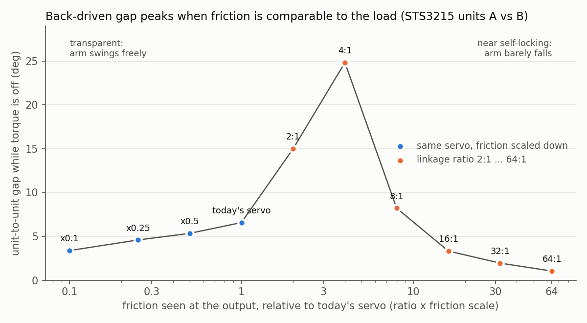

# Phase 4 진입 판단: 구조를 바꾸면 개체 차이가 줄어드는가

2026-10-01. 질문과 판정 기준은 `PLAN.md`에 결과 전에 고정했다. 숫자는 `run_gate.py`, `explore_sweep.py`가 다시 만든다.

## 쉬운 말 요약

같은 모델 서보라도 개체마다 마찰이 다르다. 그래서 한 개체로 만든 시뮬은 다른 개체를 잘 못 맞힌다.
특히 **모터를 끄고 팔이 중력에 떨어질 때** 많이 틀린다(Phase 3).

이번에는 관절 구조를 바꾸면 이 차이가 줄어드는지 시뮬로 시험했다. 시뮬에는 실제로 측정된 두 개체의 마찰을 넣었다.

- **모터가 힘을 주는 동안의 오차는 줄었다.** 감속 링크, 서보 병렬 2개, 높은 제어 게인 모두 40~53% 줄였다.
- **모터를 끈 동안의 오차는 오히려 커졌다.** 감속 링크 2:1에서 2.3배, 4:1에서 3.8배, 병렬 2개에서 1.4배.
  → 미리 정한 기준으로 **Phase 4 진입 조건은 불합격**이다.
- 이유를 따라가 보니 단순한 규칙이 나왔다(탐색 분석). **마찰이 하중과 비슷한 크기일 때 개체 차이가 가장 크게 드러난다.**
  마찰을 줄여 관절을 매끄럽게 하거나(마찰 0.1배 → 3.4°), 아예 안 밀리게 하면(감속 64:1 → 1.0°) 차이가 작아진다.
  지금 서보(6.6°)는 이미 그 중간 쪽에 있고, 감속 링크를 더하면 최악의 구간(2:1~4:1, 15~25°)으로 들어간다.

**설계에 주는 뜻.** 조작(물건 잡기, 접촉) 로봇은 밀렸을 때 따라 움직여야 안전하다. 그래서 "안 밀리게" 쪽은 목표와 맞지 않는다.
남는 방향은 **마찰 자체를 줄이는 것**이다. 원래 설계의 자기 기어(접촉 없이 힘을 전달해 마찰이 작다)는 이 방향과 맞다.
반면 "평행링크로 오차를 기구학적으로 걸러낸다"는 아이디어는, 적어도 감속비와 병렬 구동만으로는 역구동 오차를 줄이지 못했다.

## 방법

- 개체 A: Rhoban의 STS3215 7.4V (Phase 3 M6 모델). 개체 B: 모터 상수는 A와 같고, 마찰만 T-K-233의 STS3215 12V 개체 값이다.
- 오차: A로 계산한 출력 각도와 B로 계산한 출력 각도의 평균 절대 차이. A와 B를 바꿔 한 번 더 계산하고 평균했다.
- 동작: Phase 3의 7.4V 로그 100개에 기록된 명령과 하중. 토크를 끄는 구간은 `lift_and_drop` 로그에만 있다.
- 시뮬레이터: BAM의 계산 순서를 그대로 따르되, 서보 여러 개와 감속비를 넣을 수 있게 일반화했다(`multisim.py`).
  서보 1개·비율 1로 돌리면 BAM 시뮬레이터와 결과가 정확히 같았다(최대 차이 0 rad).
- 링크는 이상적이다(링크 자체의 마찰·유격·유연성 0).

## 결과 (사전 등록)

| 구조 | 구동 중 오차 | 줄어든 비율 | 모터 끈 동안 오차 | 줄어든 비율 |
|---|---|---|---|---|
| S0 기준 (서보 직결) | 0.68° | — | 6.6° | — |
| S1 제어 게인 4배 | 0.36° | 47% | 6.6° | -1% |
| S2 감속 링크 2:1 | 0.41° | 40% | 15.0° | -128% |
| S2b 감속 링크 4:1 | 0.41° | 41% | 24.8° | -277% |
| S3 서보 병렬 2개 | 0.32° | **53%** | 9.4° | -43% |

5 ms 기준. 1 ms로 다시 돌려도 모든 비율이 ±0.01 안에서 같았다(수치 오차 무시 가능).

- 진입 조건(링크 계열이 모터 끈 동안의 오차를 50% 이상 줄임): **불합격.** 셋 다 오히려 늘었다.
- 구동 중 오차를 50% 이상 줄인 것은 S3(서보 병렬 2개)뿐이다. 서보 두 개의 마찰 차이가 평균되기 때문이다(A+B를 A+A로 예측하면 차이가 절반이 된다).
- 대가: S2·S2b는 최고 속도가 1/2, 1/4로 준다. S3는 서보가 두 배 든다.

## 원인 (탐색 분석, 사전 등록 아님)

모터를 끄면 팔을 움직이는 힘은 중력뿐이고, 막는 힘은 마찰이다.

- 마찰이 중력보다 훨씬 작으면 팔은 거의 자유롭게 흔들린다. 마찰 값이 조금 달라도 움직임은 크게 달라지지 않는다.
- 마찰이 중력보다 훨씬 크면 팔은 거의 안 떨어진다. 두 개체 모두 "안 움직임"이라 차이가 작다.
- 둘이 비슷하면 팔이 언제 멈추는지가 마찰 값에 민감해져서 개체 차이가 크게 드러난다.

감속비 n은 출력에서 본 마찰을 n배로 키운다. 그래서 감속비를 올리는 것은 위 그래프에서 오른쪽으로 가는 것과 같다.

| 출력에서 본 마찰 (지금 서보 = 1) | 만든 방법 | 모터 끈 동안 오차 | 팔이 움직인 거리 (로그당) |
|---|---|---|---|
| 0.1 | 마찰 0.1배 | 3.4° | 12,218° |
| 0.25 | 마찰 0.25배 | 4.6° | 8,832° |
| 0.5 | 마찰 0.5배 | 5.3° | 5,212° |
| 1 | 지금 서보 | 6.6° | 2,558° |
| 2 | 감속 2:1 | 15.0° | 1,647° |
| 4 | 감속 4:1 | 24.8° | 866° |
| 8 | 감속 8:1 | 8.2° | 292° |
| 16 | 감속 16:1 | 3.3° | 91° |
| 32 | 감속 32:1 | 1.9° | 52° |
| 64 | 감속 64:1 | 1.0° | 27° |

주의: 감속비는 마찰만 바꾸는 게 아니라 모터 관성(n²배)과 속도도 바꾼다. 그래서 가로축은 대략적인 정리다.

## 다음에 할 수 있는 것

1. **마찰을 줄이는 쪽을 정량화한다.** 자기 기어나 직접 구동의 실제 마찰 범위를 문헌에서 찾아,
   "마찰을 몇 배 줄이면 역구동 오차가 기준 이하로 내려오는가"를 사전 등록해 시험한다.
2. **백래시(기어 유격)를 모델에 넣는다.** 평행링크·예압 구조의 진짜 장점은 유격 제거인데, 이번 모델에는 유격이 없었다.
   유격을 넣으면 링크 구조가 다르게 평가될 수 있다.
3. 시제품은 보류한다(빌드맵 규칙: "안 나오면 관절 설계 재검토 우선").

## 한계

- 개체 쌍이 하나뿐이다. 두 개체는 전압 버전도 다르다.
- 백래시, 링크 마찰, 유연성이 없다.
- 하중은 진자 하나(질량 0~1.08 kg, 팔 0.1~0.15 m)다.
